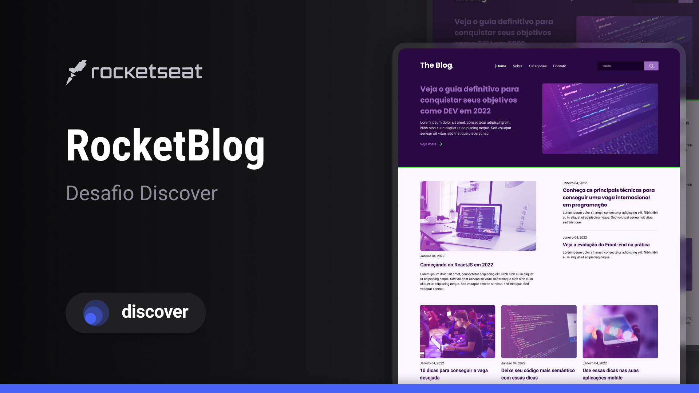

<h1 align="center"> The Blog </h1>

Projeto exclusivo e gratuito, promovido pela Rocketseat para ensino de tecnologias WEB.

  <a href="#-tecnologias">Tecnologias</a>&nbsp;&nbsp;&nbsp;|&nbsp;&nbsp;&nbsp;
  <a href="#-projeto">Projeto</a>&nbsp;&nbsp;&nbsp;|&nbsp;&nbsp;&nbsp;
  <a href="#-layout">Layout</a>&nbsp;&nbsp;&nbsp;|&nbsp;&nbsp;&nbsp;
  <a href="#memo-licença">Licença</a>

  

 

  

## 🚀 Tecnologias

Esse projeto foi desenvolvido com as seguintes tecnologias:

- HTML e CSS
- Git e Github
- Figma

## 💻 Projeto

The blog serve para armazenar noticias sobre a área de TI

## 🔖 Layout

Você pode visualizar o layout do projeto através [DESSE LINK](https://www.figma.com/file/NH9yzT1KOU8512XcCXQNC4/RocketBlog-%E2%80%A2-Desafio-Discover-(Community)?type=design&node-id=2701-9&mode=design&t=H1uEL2eorza4vHYL-0). É necessário ter conta no [Figma](https://figma.com) para acessá-lo.

##   Licença

Esse projeto está sob a licença MIT.

---

Visualizar site: https://theblogcha.netlify.app/
